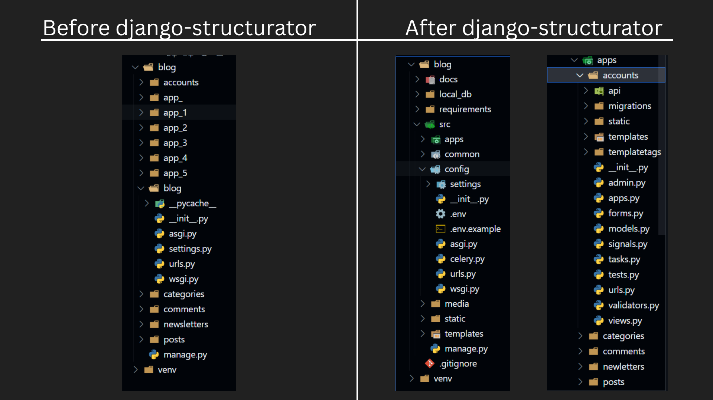
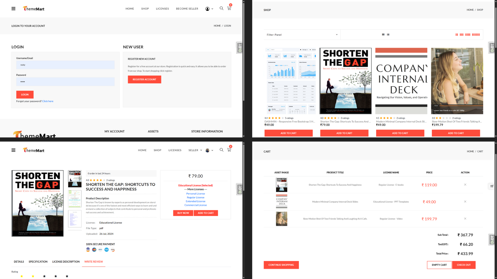
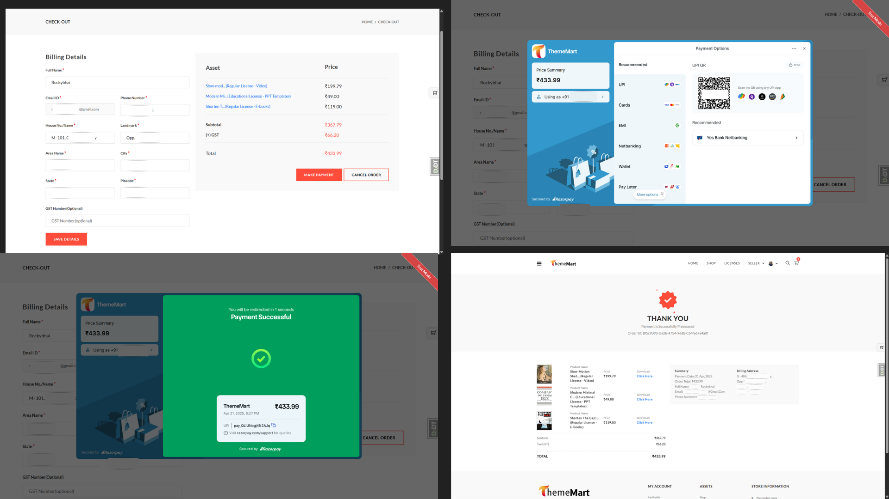
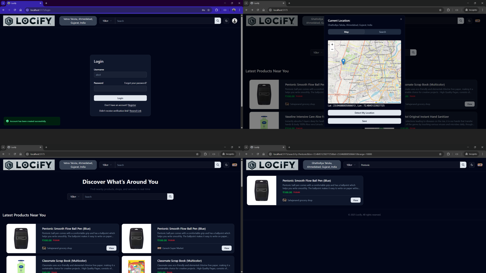
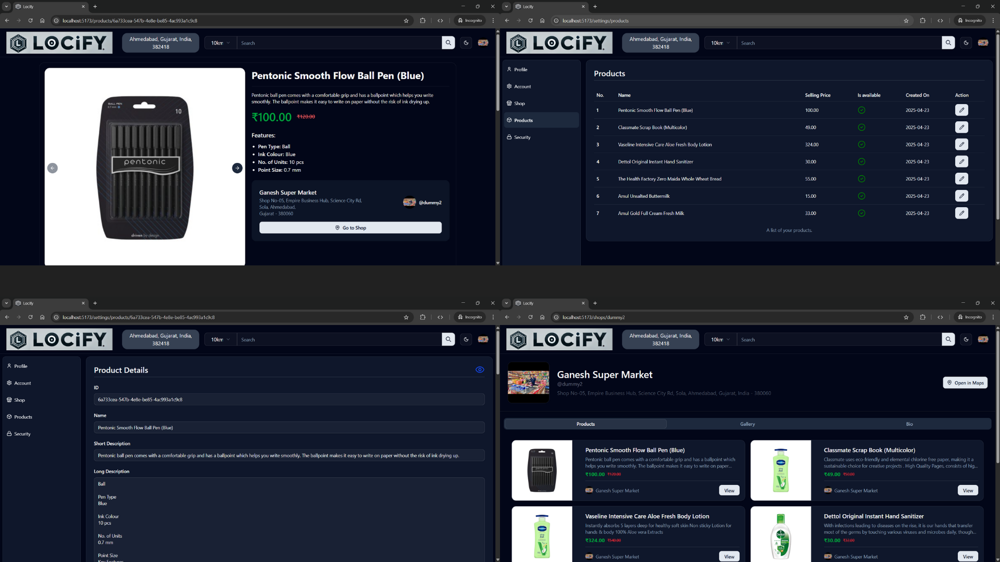

# Django Projects

### 🧱 django-structurator  
> A lightweight CLI tool that helps you create Django projects and apps with a clean, scalable architecture—without boilerplate or repetitive setup.

📌 Tech: Python, Django  
🧠 Highlights: Advanced folder structure, modular design

🔗 [Repo Link](https://github.com/maulik-0207/django-structurator)

---

### 🛒 ThemeMart – Digital Asset Marketplace  
> Sell & buy digital goods. Like ThemeForest.

📌 Tech: Django, Celery, Redis, MySQL, Razorpay, HTMX  
🧠 Highlights: Payment gateway, job queues, marketplace logic

  

  

---

### 📍 Locify – Hyperlocal Search Platform  
> Search nearby shops & products in real-time.
s
📌 Tech: DRF, React, PostgreSQL, GeoDjango, Leaflet, Tailwind, Shadcn
🧠 Highlights: Geolocation search, map UI, full stack integration

 

 

---
