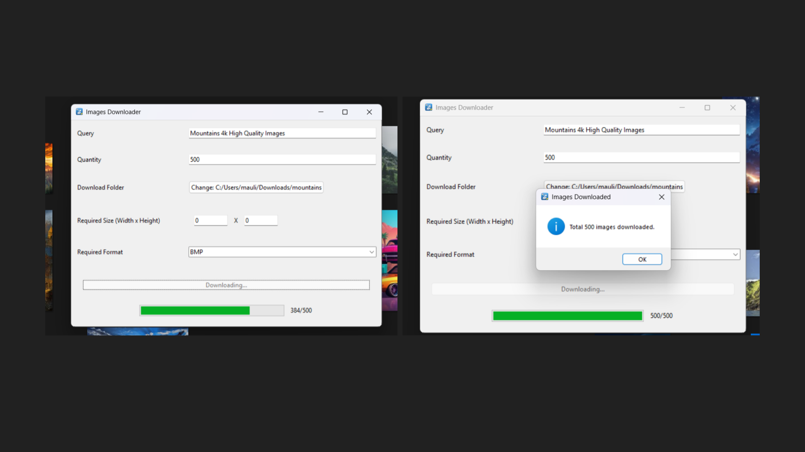
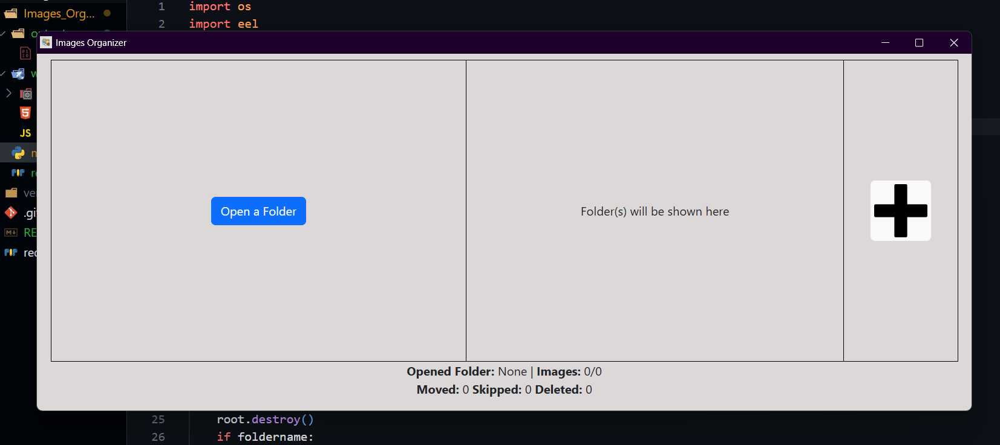
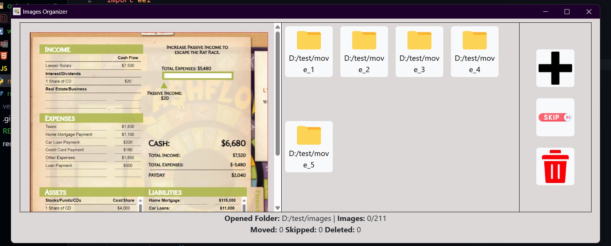

# Python Projects

### 🖼️ Google Image Scraper  
> Download upto 500 images via GUI with just a search term. (Scraping Tool)

📌 Tech: Python, Tkinter, Selenium, Pillow  
🧠 Highlights: Google scraping, custom file type & size

⬇️ Can't share because scraping tool requires frequent updates.

---

### 🖼️ Images Organizer  
> Organize your images (stored in one folder) into specific other folders.

📌 Tech: Python, Python-eel  
🧠 Highlights: Organizing images in multiple folder with other options like skip & delete the image.

⬇️ [Download EXE](./exe_files/Images%20Organizer.exe) 

---
