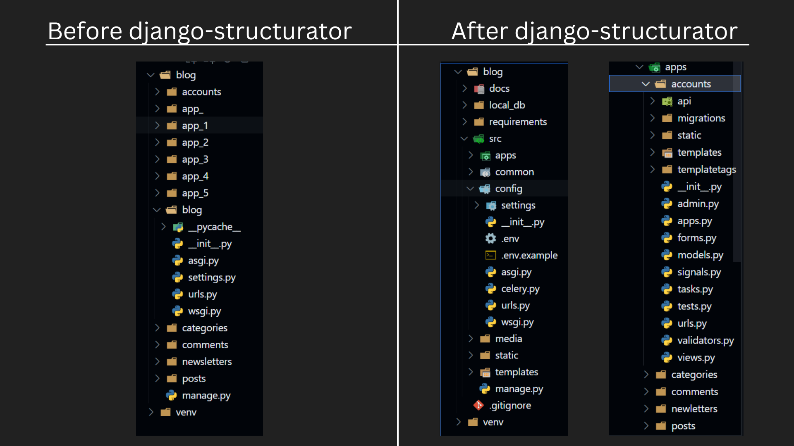
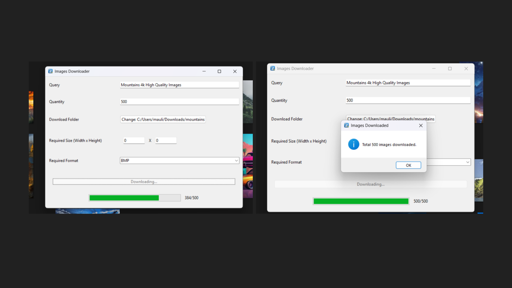
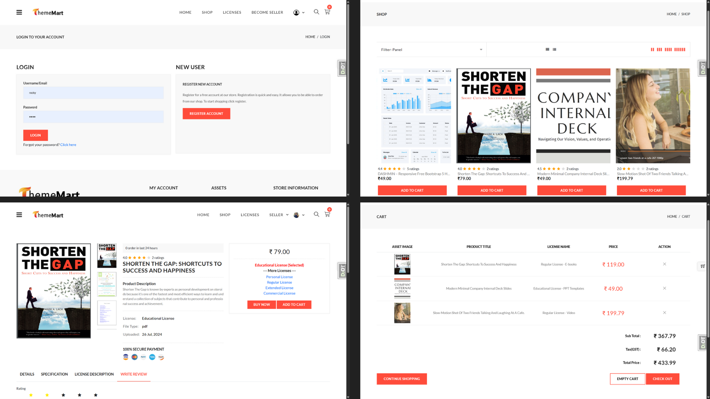
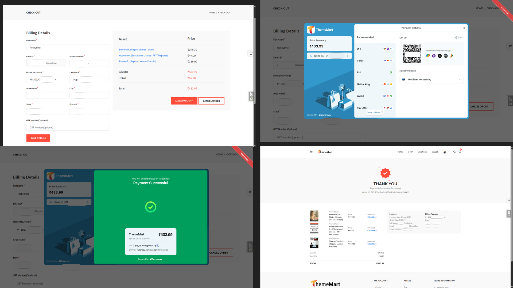
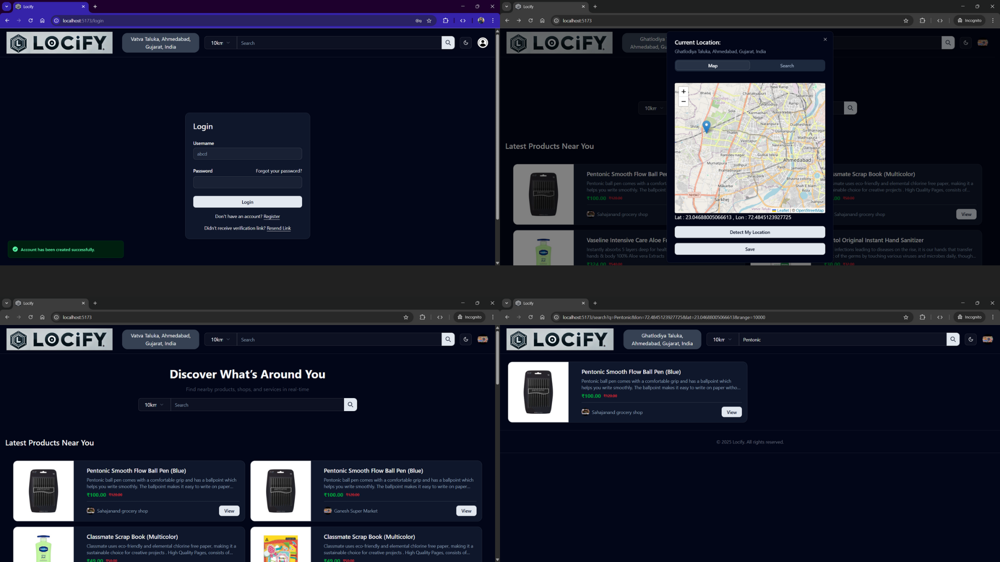
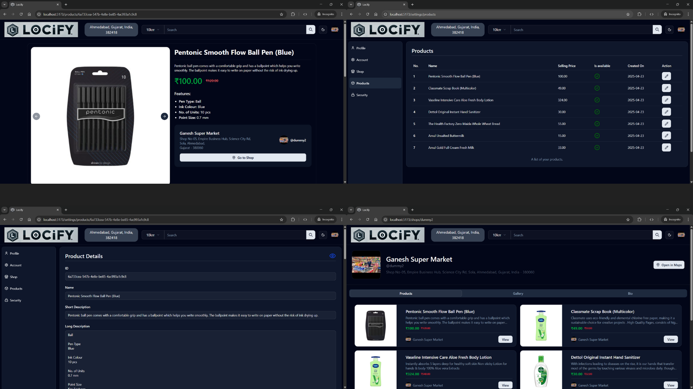

# 👋 Hey, I'm Maulik Thumar

Full-stack developer. Backend-heavy. UI-conscious. Built real apps that solve real problems.

---

## 🛠️ Core Skills

- **Languages:** Python, JavaScript, HTML, CSS
- **Backend:** Django, Django Rest Framework, Celery, Redis
- **Frontend:** React.js, HTMX, Tailwind CSS, Shadcn
- **Database:** PostgreSQL, MySQL, SQLite
- **Others:** Leaflet.js, Selenium, Pillow, Tkinter, Razorpay, GeoDjango

---

---

## 🚀 Projects

### 🧱 django-structurator  
> A lightweight CLI tool that helps you create Django projects and apps with a clean, scalable architecture—without boilerplate or repetitive setup.

📌 Tech: Python, Django  
🧠 Highlights: Advanced folder structure, modular design

🔗 [Repo Link](https://github.com/maulik-0207/django-structurator)

---

### 🖼️ Google Image Scraper  
> Download upto 500 images via GUI with just a search term. (Scraping Tool)

📌 Tech: Python, Tkinter, Selenium, Pillow  
🧠 Highlights: Google scraping, custom file type & size

<!-- 🔗 [Repo Link](#) -->

---

### 🛒 ThemeMart – Digital Asset Marketplace  
> Sell & buy digital goods. Like ThemeForest.

📌 Tech: Django, Celery, Redis, MySQL, Razorpay, HTMX  
🧠 Highlights: Payment gateway, job queues, marketplace logic

  

  

<!-- 🎥 [Watch Demo](path/to/thememart-demo.mp4) -->

<!-- 🔗 [Repo Link](#) -->

---

### 📍 Locify – Hyperlocal Search Platform  
> Search nearby shops & products in real-time.

📌 Tech: DRF, React, PostgreSQL, GeoDjango, Leaflet, Tailwind, Shadcn
🧠 Highlights: Geolocation search, map UI, full stack integration

 

 

<!-- 🎥 [Watch Demo](path/to/locify-demo.mp4) -->

<!-- 🔗 [Repo Link](#) -->

---

## 📫 Contact

[x.com](https://x.com/Maulik_0207) · [Email](mailto:maulikthumar785@gmail.com)
